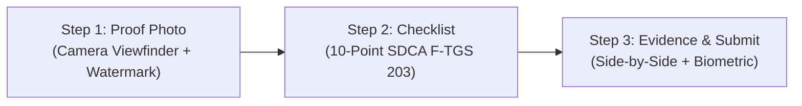

# The "Design 3's" System Specification & Usage Guide
**Klir Mobile (Smart Flush Field Operations)**  
*Standard Operating Architecture, UX Principles, and Component Implementation Guide*

---

## 1. Executive Overview & Core Philosophy

The **"Design 3's"** framework is an enterprise-grade mobile UX design system developed specifically for the **Klir Mobile** field technician application. Frontline sanitation and facilities technicians operate in high-friction physical environments (wet floors, low light, offline basements, protective gear). 

To eliminate operational mistakes and minimize cognitive strain, the design system is anchored in three strict design laws:
1. **"Less, but better" (*Weniger, aber besser*)** — Dieter Rams' principle: Every element, border, and badge must serve a direct operational purpose.
2. **The 0.5-Second Glanceability Rule** — A technician must be able to absorb critical location, urgency, and instructions in under half a second.
3. **Ergonomic Progressive Disclosure** — Complex multi-step workflows (photos, 10-point checklists, biometric validation) are revealed sequentially through slide-up modal sheets rather than disorienting full-page stack jumps.

---

## 2. The 3 Foundational Pillars of "Design 3's"

```
                     ┌─────────────────────────────────────────┐
                     │           THE "DESIGN 3's"              │
                     └────────────────────┬────────────────────┘
                                          │
         ┌────────────────────────────────┼────────────────────────────────┐
         │                                │                                │
         ▼                                ▼                                ▼
  ┌──────────────┐                 ┌──────────────┐                 ┌──────────────┐
  │   PILLAR 1   │                 │   PILLAR 2   │                 │   PILLAR 3   │
  │ Design       │                 │ Design       │                 │ Design       │
  │ Pattern      │                 │ Rule         │                 │ Psychology   │
  └──────┬───────┘                 └──────┬───────┘                 └──────┬───────┘
         │                                │                                │
  • Single Unified Card            • Zero Redundancy                • 0.5s Glanceability
  • Progressive Disclosure         • High-Contrast Solid Tones      • Thumb-Zone Reach
  • Single-Row Header              • Single Dismiss Affordance      • Polling Isolation
```

---

### 🏛️ Pillar 1: Design Pattern (Unified Architecture & Progressive Disclosure)

* **Single Unified Hero Card Pattern**:
  * Instead of fragmenting data across multiple cards (*Location Card, Specs Card, Status Card, Issue Card*), unify everything into a single primary card with clear typographic hierarchy.
  * *Implementation Reference*: [`screens/ActiveTaskScreen.tsx`](file:///c:/Users/justi/Development/Smart-Flush-Mobile-App/screens/ActiveTaskScreen.tsx) and [`screens/InboxScreen.tsx`](file:///c:/Users/justi/Development/Smart-Flush-Mobile-App/screens/InboxScreen.tsx).
* **Slide-Up Bottom Sheet Workflow**:
  * Replace full-page screen stack pushes with a cohesive slide-up modal bottom sheet (`TaskExecutionModal`).
  * Keeps the worker grounded in their current context without confusing back-arrow trails.
* **Single-Row Navigation Header**:
  * Clean, streamlined header bar containing `Step X of 3 • Title` + location breadcrumb on the left, and a circular `✕` close button on the right.
  * Eliminates redundant grab handles (`---`) when close buttons are already present.

---

### 📐 Pillar 2: Design Rule ("Less, but better" & Zero Redundancy)

* **Zero Badge / Pill Collisions**:
  * Never display duplicate badges indicating the same information (e.g. status pill + status card + status text).
  * Component metadata, floor, building, and shift are rendered exactly once in a structured breadcrumb (`2F • 2F Male Restroom • GB3 Building`).
* **Solid Contrast & Zero Washed-Out Opacity**:
  * Buttons and interactive elements in loading states must preserve solid brand color (`#B5121B`) with crisp 100% white (`#FFFFFF`) text/spinner.
  * **Strictly Prohibited**: Setting whole-button container `opacity: 0.5` during network loading, which turns crimson into faded translucent pink.
* **Single Dismiss Affordance**:
  * If a sheet has a circular `✕` close button, omit the grab handle pill (`---`). Having both creates visual noise and double vertical dead space.

---

### 🧠 Pillar 3: Design Psychology (Cognitive Load & Ergonomics)

* **0.5-Second Glanceability Rule**:
  * Information hierarchy flows top-to-bottom:
    1. Status & Priority Badge (`[Acknowledged]`, `[Hardware Alert]`)
    2. Primary Restroom Name (`Restroom 2`)
    3. Location Breadcrumbs (`Ground • toilet-01 • GB3`)
    4. Callout Instruction Box (Amber tint `#FEF9E7` with border `#FDE68A`)
    5. Primary Action CTA (`Take Proof Photo`)
* **Thumb-Zone Ergonomics**:
  * High-priority primary actions are positioned in the bottom 40% of the viewport.
  * Minimum touch target height: `52dp` with `borderRadius: 14dp`.
* **Dead Space Optimization**:
  * In Step 1 (Proof Photo), replace empty voids with a dashed Camera Viewfinder frame, live security tags (`Location Watermark`, `Biometric Encrypted`), and a full-width camera trigger.
* **Polling-Resilient Workflow State**:
  * Local checklist checkboxes and captured photo states are preserved in component memory and isolated from 10s background network polling refreshes.

---

## 3. The 3-Step Guided Task Execution Flow

Every maintenance and sanitization work order moves through a standardized 3-step lifecycle inside [`components/TaskExecutionModal.tsx`](file:///c:/Users/justi/Development/Smart-Flush-Mobile-App/components/TaskExecutionModal.tsx):



```
┌────────────────────────────────────────────────────────────────────────┐
│ STEP 1: INITIAL PROOF PHOTO                                            │
│ • Displays amber task instruction prompt                              │
│ • Dedicated viewfinder area with dashed boundary                      │
│ • Live security metadata tags (Location Watermarked, Biometric Guard) │
│ • [ 📷 Take Initial Proof Photo ] button in thumb zone                 │
├────────────────────────────────────────────────────────────────────────┤
│ STEP 2: SDCA F-TGS 203 10-POINT CHECKLIST                              │
│ • Progress bar with real-time completion counter (e.g. 7/10 done)     │
│ • Chunked categories: Dusting, Sanitization, Floor & Fixtures          │
│ • Fast multi-state selectors: [ Done ✓ ] | [ N/A - ]                   │
│ • [ Next: Review & After Photo → ] enabled only when 100% complete     │
├────────────────────────────────────────────────────────────────────────┤
│ STEP 3: DUAL EVIDENCE COMPARISON & BIOMETRIC SUBMISSION                │
│ • Side-by-side Before Photo vs. After Photo comparison container       │
│ • Watermarked timestamps and biometric badge                           │
│ • Optional remarks field                                               │
│ • [ Complete & Verify Biometrics 🔒 ] triggers native fingerprint/FaceID│
│ • Auto-queues to local offline SQLite/AsyncStorage if offline          │
└────────────────────────────────────────────────────────────────────────┘
```

---

## 4. Design Tokens & Visual Language

All styles are defined centrally in [`components/MaintenanceUI.tsx`](file:///c:/Users/justi/Development/Smart-Flush-Mobile-App/components/MaintenanceUI.tsx). Never hardcode ad-hoc colors or inline font styles.

### 4.1 Color Palette (`SDCA_COLORS` / `KLIR_COLORS`)

| Token Name | Hex Code | Usage Scenario |
| :--- | :--- | :--- |
| `primary` | `#B5121B` | Primary action buttons, brand accents, active tab icons |
| `primaryDark` | `#8F0D16` | Pressed states, high-priority alert borders |
| `primarySoft` | `#FEE2E2` | Hardware failure alert container backgrounds |
| `gold` | `#C9A227` | Shift indicators, secondary accents, supervisor stars |
| `goldSurface` | `#FEF9E7` | Task instruction callout box background |
| `goldBorder` | `#FDE68A` | Task instruction callout box border |
| `charcoal` | `#222222` | H1/H2 headlines, primary text, card titles |
| `slate` | `#333333` | Body copy, checklist item titles |
| `slateMuted` | `#666666` | Secondary subtitles, timestamps, breadcrumbs |
| `canvas` | `#F3F3F3` | App screen background, card placeholder boxes |
| `cardSurface` | `#FFFFFF` | Elevated cards, bottom sheet containers |
| `success` | `#16A34A` | Completed status, biometric verified chips, sync OK |
| `warning` | `#F59E0B` | In-progress status, reassignment needed |
| `danger` | `#B5121B` | Hardware failure alerts, emergency leaks |

### 4.2 Typography Hierarchy (`KLIR_TYPOGRAPHY`)

| Style Token | Size / Line-Height | Weight | Letter-Spacing | Usage |
| :--- | :--- | :--- | :--- | :--- |
| `h1` | `28px / 34px` | `800` | `-0.5px` | Screen main titles (e.g. "Today's Tasks") |
| `h2` | `22px / 28px` | `700` | `-0.3px` | Restroom hero headlines ("Restroom 2") |
| `h3` | `18px / 24px` | `700` | `0` | Section headings, modal titles |
| `title` | `16px / 22px` | `600` | `0` | Card titles, checklist category headers |
| `body` | `15px / 22px` | `400` | `0` | Standard descriptive text, issue messages |
| `bodyMuted` | `14px / 20px` | `400` | `0` | Subtitles, location breadcrumbs |
| `caption` | `12px / 16px` | `500` | `0` | Timestamps, relative time tags |
| `labelUpper` | `11px / 14px` | `700` | `+0.8px` | Uppercase section badges, tag headers |
| `button` | `15px / 20px` | `700` | `+0.3px` | CTA button labels |

### 4.3 Spacing Grid & Elevation

* **Base Unit**: 4dp (`xs: 4`, `sm: 8`, `md: 12`, `lg: 16`, `xl: 20`, `xxl: 24`, `xxxl: 32`).
* **Card Border Radius**: `14dp` for cards, `20dp` for modal sheets, `999dp` for pill badges.
* **Shared Shadow (`sharedShadow`)**:
  ```ts
  export const sharedShadow = {
    elevation: 2,
    shadowColor: '#000000',
    shadowOffset: { width: 0, height: 1 },
    shadowOpacity: 0.08,
    shadowRadius: 3,
  };
  ```

---

## 5. Component Construction Rules

### 5.1 Buttons (`components/KlirButton.tsx`)

```tsx
// ✅ CORRECT: Decouple static disabled visual style from active loading state
const isInteractionDisabled = disabled || loading;
const isStaticDisabled = disabled && !loading;

<TouchableOpacity
  disabled={isInteractionDisabled}
  style={[
    styles.baseButton,
    isStaticDisabled && styles.disabled, // Only dims opacity when explicitly disabled
    style,
  ]}
>
  {loading ? (
    <ActivityIndicator size="small" color="#FFFFFF" /> // 100% solid contrast
  ) : (
    <Text style={styles.buttonText}>{label}</Text>
  )}
</TouchableOpacity>
```

**Anti-Pattern to Avoid**:
```tsx
// ❌ WRONG: Fades the button to 50% opacity pale pink on active network request
const isDisabled = disabled || loading;
<TouchableOpacity style={[styles.button, isDisabled && { opacity: 0.5 }]}>
```

---

### 5.2 Top Navigation & Sheet Header Bar

```tsx
// ✅ CORRECT: Sleek single-row header bar
<View style={styles.modalHeader}>
  <View style={styles.modalHeaderTitleBlock}>
    <Text style={styles.modalStepBadge}>Step 1 of 3 • Proof Photo</Text>
    <Text style={styles.modalSubTitle}>Restroom 2 • toilet-01 (GB3)</Text>
  </View>
  <TouchableOpacity onPress={onDismiss} style={styles.closeCircleButton}>
    <MaterialCommunityIcons name="close" size={20} color="#666666" />
  </TouchableOpacity>
</View>
```

**Anti-Pattern to Avoid**:
```tsx
// ❌ WRONG: Stacked grab handle pill + separate floating close icon creating 40dp dead space
<View style={styles.handleContainer}><View style={styles.handle} /></View>
<TouchableOpacity style={styles.floatingClose}><Icon name="close" /></TouchableOpacity>
```

---

### 5.3 Task Callout Box

```tsx
// ✅ CORRECT: High-visibility instruction callout
<View style={styles.instructionCallout}>
  <MaterialCommunityIcons name="clipboard-text-outline" size={18} color="#B5121B" />
  <View style={styles.instructionTextWrapper}>
    <Text style={styles.instructionLabel}>INSTRUCTION</Text>
    <Text style={styles.instructionText}>{task.message}</Text>
  </View>
</View>
```

---

## 6. Hardware Failure Alert Architecture

Hardware failure alerts detected by IoT sensors trigger across three synchronized channels:

1. **Top In-App Push Banner**: Drops down immediately with `[View]` button.
2. **Red Priority Alert Card**: Top of Inbox screen with `[Open Priority Task →]`.
3. **Task List Item**: Marked with high-urgency red badge `[Hardware Alert]` and `[Acknowledge & Start]`.

### Testing via QA Simulator
Technicians and testers can trigger hardware alerts without physical hardware:
1. Tap avatar `JL` in the top right header.
2. Under **SYSTEM SIMULATOR**, tap `Test Hardware Alert 🚨`.
3. The modal dismisses, firing both the in-app push banner and the Inbox priority card.

---

## 7. Developer Verification Checklist

Before submitting or committing any UI changes:

- [ ] **TypeScript Check**: Run `npm run typecheck` $\rightarrow$ must return `0 errors`.
- [ ] **Test Suite Check**: Run `npm test` $\rightarrow$ all 16 test suites must pass (126/126 tests).
- [ ] **No Washed-Out Buttons**: Verify loading state on primary buttons retains `#B5121B` background and `#FFFFFF` spinner.
- [ ] **No Double Handles**: Check that bottom sheets do not contain redundant grab handles (`---`) when close buttons exist.
- [ ] **No Database Tables on Active Screens**: Active views must only show the Hero Card; omit technical database specification tables.
- [ ] **Touch Targets**: All interactive elements must have at least `48dp` (preferably `52dp`) touch targets.
- [ ] **Design Tokens**: All colors and typography must use `KLIR_COLORS` and `KLIR_TYPOGRAPHY` from [`components/MaintenanceUI.tsx`](file:///c:/Users/justi/Development/Smart-Flush-Mobile-App/components/MaintenanceUI.tsx).
